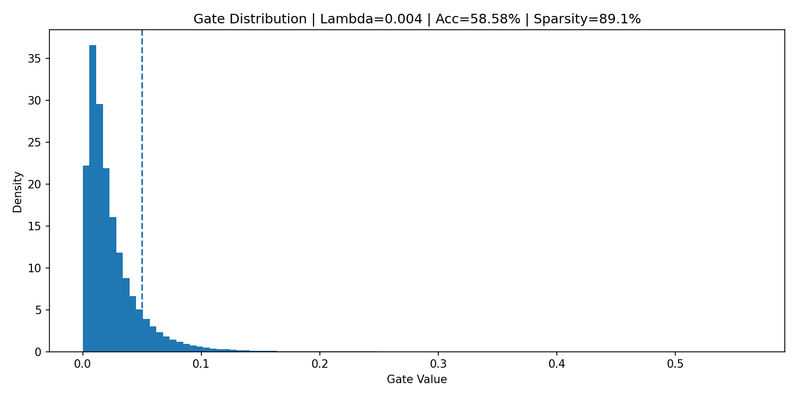

# self_pruning_feedforward_NN_Trendence
# Self-Pruning Feedforward Neural Network on CIFAR-10

An AI engineering case study implementing a **self-pruning neural network** in PyTorch using learnable gate parameters.  
The model dynamically removes weak connections during training through differentiable gating and L1 sparsity regularization.

This project was built as part of the **Tredence AI Engineering Internship Case Study**.

---

## Project Objective

Traditional pruning removes weights **after training**.  
This project explores a better approach:

> Allow the network to learn which weights are unnecessary **during training itself**.

Each weight is paired with a learnable gate:

\[
W_{final} = W \cdot \sigma(G)
\]

Where:

- `W` = trainable weights  
- `G` = learnable gate scores  
- `sigmoid(G)` = gate values between 0 and 1

If a gate approaches 0, that connection is effectively pruned.

---

## Architecture

Feedforward neural network:

3072 → 1024 → 512 → 256 → 10

Input:

- CIFAR-10 images (32 × 32 × 3)
- Flattened into 3072 features

Layers used:

- Custom `PrunableLinear`
- Batch Normalization
- ReLU
- Dropout

---

## Loss Function

Total training loss:

L = CrossEntropy + λ × SparsityLoss

Where SparsityLoss is:

- Sum of all gate values across the network
- Encourages gates to move toward zero

---

## Experimental Results

| Lambda | Test Accuracy | Sparsity |
|--------|--------------|----------|
| 0.002 | 58.36% | 88.88% |
| 0.004 | **58.58%** | **89.13%** |
| 0.006 | 58.46% | 89.21% |

### Best Overall Model

**λ = 0.004**

- Highest accuracy: **58.58%**
- High sparsity: **89.13%**

This demonstrates that most parameters can be removed while preserving competitive accuracy.

---

## Gate Distribution

The histogram below shows learned gate values.

---

